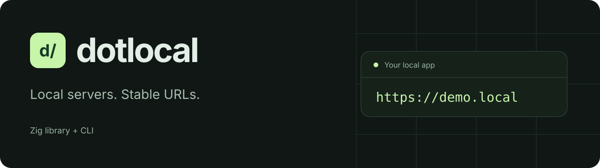

<p align="center">
  
</p>

<p align="center">
  <strong>One name. Any server.</strong><br>
  A native Zig library and CLI for stable local URLs.
</p>

<p align="center">
  <a href="https://github.com/euforicio/dotlocal/actions/workflows/ci.yml"></a>
  <a href="https://ziglang.org/download/0.17.0/"></a>
  
  <a href="#for-agents"></a>
</p>

<p align="center">
  <a href="#quick-start">Quick start</a> ·
  <a href="#run-any-server">CLI</a> ·
  <a href="#use-as-a-library">Library</a> ·
  <a href="#for-agents">Agents</a> ·
  <a href="zig/README.md">Reference</a>
</p>

---

Your app can change ports. Its URL can stay the same.

**dotlocal** routes a stable name to a local HTTP or HTTPS server, starts commands
with a usable listening port, and removes owned routes when those commands exit.
Use it with a compiled binary, a development server, or a validated container
endpoint. The library, CLI, demo, integration fixtures, and benchmark drivers
are written in Zig.

| | What you get |
| :--- | :--- |
| **Stable names** | `https://api.local` for developers and agents, with no port in the public URL. |
| **Any server** | Direct command execution, injected `PORT` / `HOST` / `DOTLOCAL_URL`, and aliases for existing servers. |
| **Real transports** | HTTP/1, HTTP/2, WebSockets, streaming responses, and verified HTTPS upstreams. |
| **Small native core** | An executable and an importable Zig module; statically linked OpenSSL and nghttp2. |
| **Local by default** | Loopback listeners, authenticated local management, private state, and explicit sharing. |
| **Agent workflow** | An installable skill/plugin that uses the same shared `.local` HTTPS service. |

## Install

```sh
curl -fsSL https://raw.githubusercontent.com/euforicio/dotlocal/main/release/install.sh | sh
```

Installs the latest stable release to `~/.local/bin/dotlocal` (macOS and Linux,
arm64 and x86_64) without sudo; set `DOTLOCAL_INSTALL_DIR` to choose another
directory. Add `-s -- --nightly` for nightly builds. The script checks the
archive's SHA-256; dotlocal verifies the signed release manifest before every
self-update.

### Updating

dotlocal keeps itself up to date: about once a day, after a command finishes, it
checks for a signed release and installs it in the background, then prints a
one-line notice on the next run. The installed macOS service updates itself the
same way and restarts. Turn this off with `dotlocal config set auto_update false`.
Update now with `dotlocal update`; roll back to the previous stable release with
`dotlocal update --version X` (this pins X until the next `dotlocal update`),
then run `dotlocal init` to roll back the installed service too. Stable keeps
the two newest releases; if both are bad, a known-good commit is re-tagged as a
new, higher version.
Installs under Homebrew or Nix are left to their package manager. See the
[update reference](zig/README.md#updates-and-user-configuration).

## Quick start

Build from source with **Zig 0.17.0** on macOS or Linux:

```sh
git clone https://github.com/euforicio/dotlocal.git
cd dotlocal
./zig/scripts/bootstrap-deps
zig build -Doptimize=ReleaseSafe
export PATH="$PWD/zig-out/bin:$PATH"
```

Bootstrap requires a C development toolchain, make, Perl, curl, shasum, and tar.
It builds checksum-pinned OpenSSL **4.0.3** and nghttp2 **1.70.0** inside the
ignored `.zig-deps` directory. See the [build guide](zig/README.md#build-and-validate)
for an existing dependency prefix.

### Run the demo at https://demo.local

On macOS, install the shared loopback service once, then start the demo:

```sh
dotlocal init
dotlocal demo ./zig-out/bin/dotlocal-demo
# https://demo.local
```

`init` requests administrator authentication to install listeners on 80/443 and
trust the local CA. App commands run as your ordinary user, including commands
started by agents. Reuse the installed service for subsequent apps. Configure
local DNS or review and explicitly apply the registered hostnames:

```sh
dotlocal hosts sync
sudo dotlocal hosts sync --apply
```

Open **<https://demo.local>**. Keep the app command running while you use it;
Ctrl-C stops the app and removes its route. Linked Git worktrees receive a
branch prefix, so use the printed URL. Leave the shared service running.

| Profile | Public URL | Setup |
| :--- | :--- | :--- |
| Developer and agent default | `https://demo.local` | Shared macOS service, CA trust, and local name resolution. |
| Linux daemon | `https://demo.local` | Foreground daemon with permission for 80/443; caller-managed DNS and CA trust. |

The Linux routing core and user proxy are supported. Service installation and
system trust automation are currently macOS-specific. See the
[Linux guide](zig/README.md#linux) for the daemon setup.

[Alternate listener profiles](zig/README.md#cli) are available when explicitly
selected; the agent skill keeps the normal `.local` HTTPS default.

## Run any server

With your selected proxy running:

```sh
# A server that reads PORT and HOST.
dotlocal api ./api-server

# A server that needs an explicit listening port.
dotlocal run --name web --app-port 3000 ./web-server --port 3000

# A server you already started yourself.
dotlocal alias dashboard 3000
dotlocal get dashboard
dotlocal list
dotlocal alias --remove dashboard
```

`--app-port` selects the **upstream** port. `DOTLOCAL_PORT` selects the **proxy**
port that appears in an alternate-profile URL. The server language and runtime
do not change the routing contract.

For a reusable project command, add `dotlocal.json`:

```json
{
  "name": "api",
  "command": ["./api-server"]
}
```

Run `dotlocal` in that directory. Package scripts, framework detection,
workspaces, Apple Container, and sharing adapters are optional conveniences.
See the [CLI reference](zig/README.md#cli) and
[sharing guide](zig/README.md#explicit-sharing-and-adapters).

Start an app in the background, close the terminal, and stop it later:

```sh
dotlocal start api ./api-server
dotlocal stop api
# Or: dotlocal run --background --name api ./api-server
```

`dotlocal start` without arguments uses the current project's configuration. Startup waits for the registered server's TCP port and prints its URL and private log path. `stop NAME` verifies the tracked process identity, stops its process group, and removes its owned route. Other independently started apps and the shared proxy keep running. Registered aliases remain externally managed. A background workspace shares one supervisor; stopping a member stops that workspace. Background apps survive terminal closure, but do not automatically restart after reboot.

## Use as a library

Import the same core used by the CLI:

```zig
const dotlocal = @import("dotlocal");

var table = try dotlocal.routes.Table.init(allocator, ".local", false);
defer table.deinit();
try table.set(.{ .name = "api.local", .host = "127.0.0.1", .port = 3000 });
const route = (try table.resolve(allocator, "api.local:443")).?;
defer route.deinit(allocator);
```

The build exports module `dotlocal`. APIs use explicit allocators, `std.Io`, and
owned results. Start with the [library guide](zig/README.md#library) for
`b.dependency` integration, or the [embedded example](zig/examples/embedded.zig)
for a running daemon.

## For agents

Install the bundled Codex plugin from this repository:

```sh
codex plugin marketplace add euforicio/dotlocal
codex plugin add dotlocal@dotlocal
```

Then ask:

> Use $dotlocal to run this app at its .local HTTPS URL and verify that it responds.

The [dotlocal skill](skills/dotlocal/SKILL.md) uses **`https://<name>.local` on
443**, through the same shared service used by developers. It preserves the
actual registered URL, verifies TLS and name resolution, and cleans up its
owned routes and app processes while leaving the shared proxy running. It uses
the native CLI and curl; it requires local command execution, a built or
installed `dotlocal`, and the normal service, CA trust, and DNS setup.
Installing the plugin supplies instructions, not the compiled executable.

The CLI uses the exported Zig library, and the plugin invokes that same CLI.
Proxying, certificates, hostname handling, process supervision, and route
ownership all use the existing implementation. The plugin adds no separate
server or management client.

The repo includes a portable `plugin.json`, Codex compatibility metadata, and a
repo marketplace. For another Agent Skills-compatible host, copy the
`skills/dotlocal` directory into that host's skill directory. For a repo-scoped
installation from a local clone:

```sh
mkdir -p /path/to/your-project/.agents/skills
cp -R skills/dotlocal /path/to/your-project/.agents/skills/dotlocal
```

Plugin packaging follows the [official plugin format](https://developers.openai.com/plugins/build/plugins).

## Development

```sh
zig fmt --check build.zig zig
zig build test
zig build test integration example -Doptimize=ReleaseSafe
zig build bench -Doptimize=ReleaseSafe
```

Tests exercise real files, processes, listeners, certificates, and transport
clients. [Blacksmith CI](https://github.com/euforicio/dotlocal/actions/workflows/ci.yml)
runs on macOS and Linux. Optional service, container, and exposure gates are
described in the [Zig reference](zig/README.md#verified-behavior-and-remaining-gates).

Contributions should keep the core runtime-agnostic, APIs small, and ownership
explicit. Include a reproducible case for a bug and run the checks relevant to
your change. Open an [issue](https://github.com/euforicio/dotlocal/issues) or
[pull request](https://github.com/euforicio/dotlocal/pulls).

## License

dotlocal is released under the [MIT License](LICENSE).
